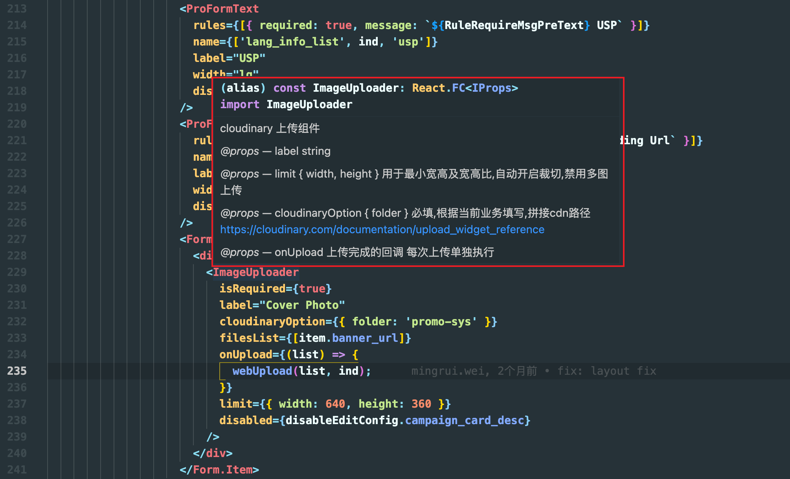

# 题外 - 注释写法

```ts
// js 中写注释一般都比较随意, 坚持写注释的人也比较少

// 在 ts 中推荐一下的注释写法


/**
 * cloudinary 上传组件
 * @props label string
 * @props limit { width, height } 用于最小宽高及宽高比,自动开启裁切,禁用多图上传
 * @props cloudinaryOption { folder } 必填,根据当前业务填写,拼接cdn路径 https://cloudinary.com/documentation/upload_widget_reference
 * @props onUpload 上传完成的回调 每次上传单独执行
 */
const Uploader: React.FC<IProps> = (props) => {}

```
代码提示的效果如下:




vue2 中 ts 的代码提示效果非常的差, 尤其在 template 中, 基本等于没有,
大家可以期待下vue3的效果

推荐 react + ts 的组合来尝试一下

如果对小程序有兴趣,可以尝试 Taro

在 Taro 中 (Taro2), 每一个官方组件都有详细的类型提示和文档地址, 是一个不错的学习模板

> 坚持写注释的都是好人
